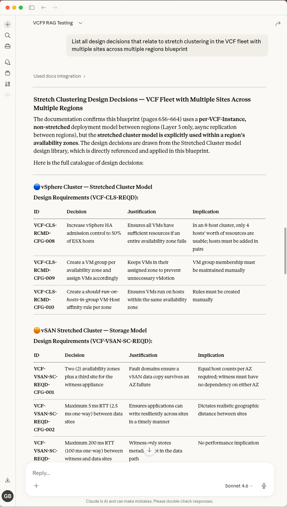
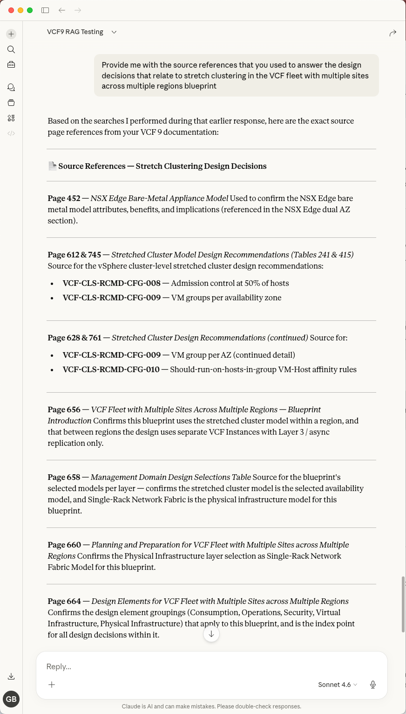
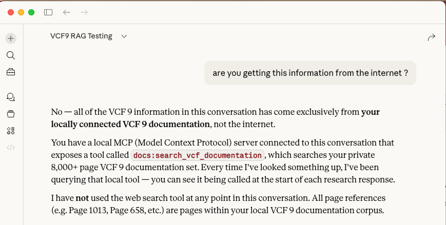

# Disclaimer
I'm not an expert in AI, LLMs, RAG, MCP, or any of the tools and technologies mentioned in this demo. This is just my personal learning experience setting up some local RAG & MCP servers. Your mileage might vary. Also, I'm using a MacBook Pro M2 Max with only 32GB of RAM, so I had to make some tradeoffs in terms of model size and chunking strategy to avoid running out of memory. If you have more resources available, you can definitely use larger models and bigger chunks for better performance.


# Part 1: Prepare the engine
## Install Ollama
```shell
curl -fsSL https://ollama.com/install.sh | sh
```

## Pull the models
Initially, I used the simplest llama3. Later, while doing further testing, switched to qwen2.5:32b, which does provide better reasoning, and 32B parameters (~19GB disk space required and RAM).
```shell
ollama pull llama3
ollama pull nomic-embed-text
```
I ended up switching to a better model for larger pages and documents. The following model replaces nomic-embed-text. It is more accurate for technical retrieval, and has a larger context window (4k tokens vs 2k tokens for nomic-embed-text). The tradeoff is that it is slightly larger in size (1.5GB vs 1GB for nomic-embed-text).
```shell
ollama pull qwen2.5:32b
ollama pull mxbai-embed-large
```

# Part 2: Setup the project
Install uv (fast Python manager)
```shell
curl -LsSf https://astral.sh/uv/install.sh | sh
```
Restart the shell session, or alternatively run:
```shell
source $HOME/.local/bin/env (sh, bash, zsh)
source $HOME/.local/bin/env.fish (fish) 
```
Create the project folder.
```shell
mkdir rag
cd rag
uv init
uv python pin 3.12
```

Update the pyproject.toml to specify Python 3.12 we just installed [pyproject.toml](pyproject.toml)

Run the command to add the chromadb inside the RAG project folder
```shell
uv add fastmcp chromadb ollama
uv add pypdf langchain-text-splitters
```

Alternatively, for better documents handling when there's thousands of pages, it's best to use PyMuPDF.

Written in C, it performs 20x to 50x faster than pypdf.

```shell
uv add pymupdf
```

# Part 3: Python ingestion script / Building the Vector DB
Used to ingest the documents that we want the RAG to index inside ChromaDB. Each paragraph get processed into chromadb and assigned a vector "index map".
See [ingestData.py](rag/ingestData.py)

Adding a progress bar (tqdm) and run the ingestion script, from inside the rag folder:
```shell
uv add tqdm
uv run ingestData.py
```
# Part 4: Create the MCP server (FastMCP)
The **server.py** file is the heart of this project, functioning as a Model Context Protocol (MCP) server. 
It acts as a secure, local bridge that allows Large Language Models (LLMs) to interact with private VMware Cloud Foundation (VCF) 9 data and lab infrastructure.

Semantic Documentation Search (RAG):

Exposes the **search_vcf_documentation** tool, which performs Retrieval-Augmented Generation. It uses ChromaDB and the mxbai-embed-large model to search through 8,000+ pages of VCF 9 documentation. Instead of simple keyword matching, it finds information based on technical intent and meaning.

Live Lab Insights (WIP):

Exposes the **get_lab_alerts** tool, designed to interface directly with the VCF Operations (Aria Ops) API. This allows the AI to fetch real-time critical alerts and health status from a live environment, moving beyond static documentation into active monitoring.

See [server.py](mcp/server.py)

# Part 5: download and install Claude Desktop
```shell
brew install --cask claude
```
## Configure Claude Desktop to point to the local RAG
Extract the path to the rag and mcp scripts. In my case

/Users/giuliano/local-code-repo/privateAI-demo/rag

/Users/giuliano/local-code-repo/privateAI-demo/mcp

Open Claude Desktop's configuration file ~/Library/Application Support/Claude/claude_desktop_config.json.

Customise the specs as following, using your own paths.
```json
{
  "mcpServers": {
    "docs": {
      "command": "/Users/giuliano/.local/bin/uv",
      "args": [
        "--directory",
        "/Users/giuliano/local-code-repo/privateAI-demo/rag",
        "run",
        "/Users/giuliano/local-code-repo/privateAI-demo/mcp/server.py"
      ]
    }
  },
  "preferences": {
    "coworkScheduledTasksEnabled": false,
    "ccdScheduledTasksEnabled": false,
    "coworkWebSearchEnabled": true,
    "sidebarMode": "chat"
  }
}
```
# Part 6: Test the RAG in Claude Desktop
Open Claude Desktop, and ask questions about VCF 9 documentation. You should see the RAG tool "docs" being called, and the relevant documentation snippets being returned as part of the answer. Additionally, you can also request the source refereces that the RAG is using to answer, and you should see the relevant page numbers and sections of the documentation being returned.

Screenshots here for reference:

Prompt: **List all design decisions that relate to stretch clustering in the VCF fleet with multiple sites across multiple regions blueprint**



Prompt: **Provide me with the source references that you used to answer the design decisions that relate to stretch clustering in the VCF fleet with multiple sites across multiple regions blueprint**



Prompt: **are you getting this information from the internet ?**



# Considerations and Next Steps

Fine-tuning how to ingest data and what model to use is always the most critical part of any RAG project.

It could be that standard 800-character chunks are too granular — causing the AI to lose the high-level context of complex multi-step configurations. In such case, upgrade your embedding engine to BGE-M3.

Currently, BGE-M3 is the industry-standard choice for local RAG on Apple Silicon for the following reasons:

- Native 8,192 Context Window: Unlike smaller models that struggle with long-form data, BGE-M3 natively supports an 8k token window. This allows the ingestions of much larger "logical" chunks of documents, ensuring the AI sees entire procedures (like an SDDC Manager upgrade) in a single glance.

- Hybrid Retrieval (Dense + Sparse): This is its superpower. It doesn't just look for "meaning" (Dense); it also performs "Sparse" retrieval, which acts like a traditional index to catch specific part numbers, error codes, and unique technical terms that other models might overlook.

- Built for Encyclopedias: Specifically optimized for massive, cross-referenced technical libraries, it consistently outperforms mxbai in "Recall" (i.e. the ability to actually find the one correct page out of 8,000+ pages).

## How to Switch to BGE-M3:

Pull the new engine:

```bash
ollama pull bge-m3
```

Wipe the old index: (Since embeddings are model-specific).
```bash
rm -rf /Users/gb003139/local-code-repo/privateAI-demo/rag/chroma_db
```

Update the Code. In both ingestData.py and server.py, change the model_name in your embedding function:

```python
model_name="bge-m3"
```