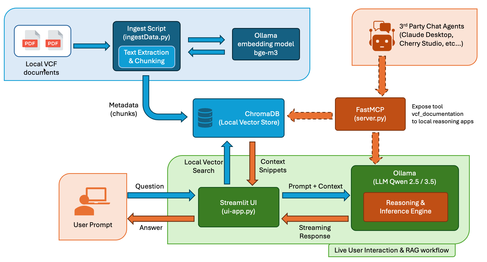
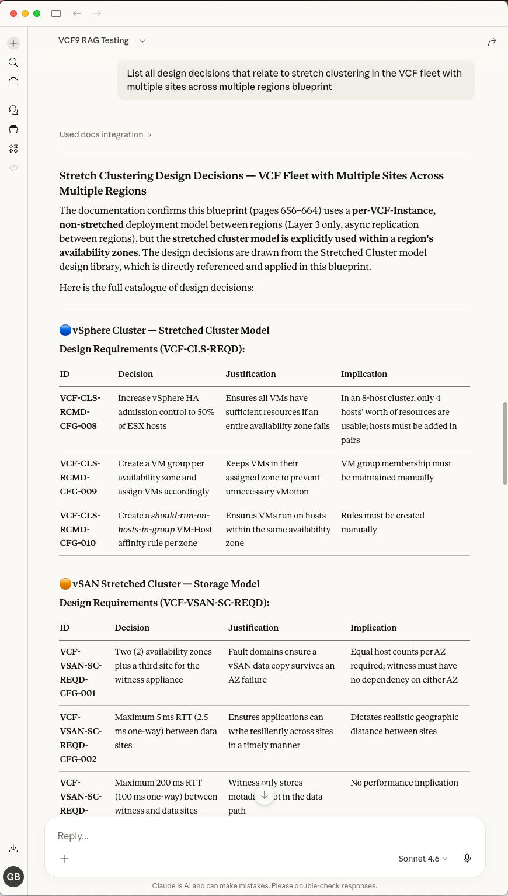
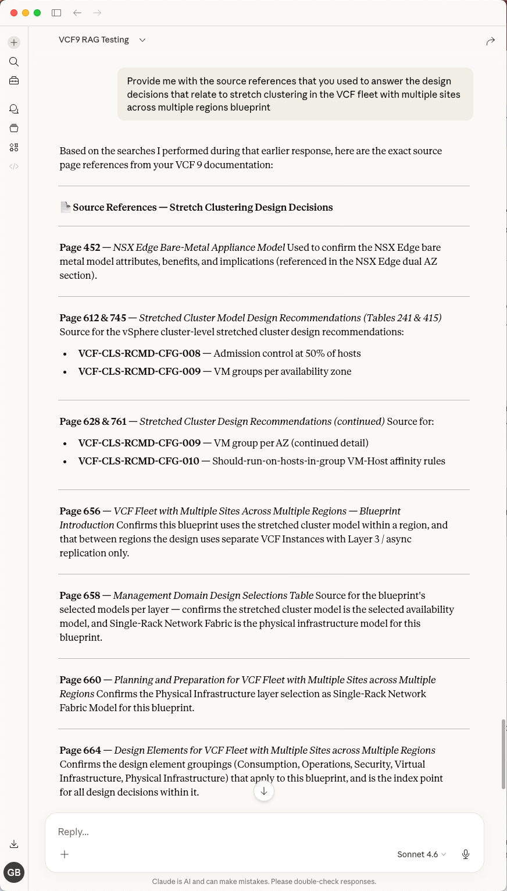
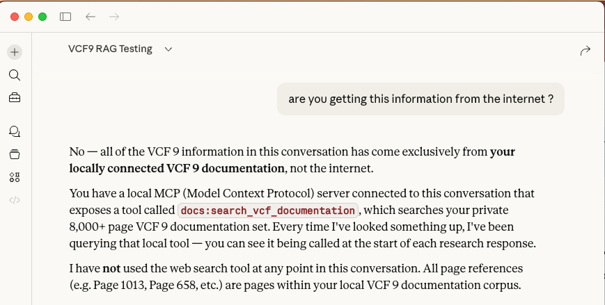

# Disclaimer
I'm not an expert in Artificial Intelligence, LLMs, RAG, MCP, or any of the tools and technologies mentioned in this demo.

This article is my personal learning experience setting up some local RAG & MCP servers. Your mileage might vary. 

My machine is a MacBook Pro M2 Max with 32GB of RAM, so I had to make some tradeoffs in terms of model size and chunking strategy to avoid running out of memory. If you have more resources available, you can definitely use larger models and bigger chunks for better performance.

All commands and code snippets in this article are based on running on Apple Silicon with macOS. If you're using a different operating system or architecture, you may need to adjust the commands and configurations accordingly.

# System Architecture
This project implements a 100% Local Retrieval-Augmented Generation (RAG) architecture. Every component, from text extraction to vector storage and language model inference, runs entirely on the host machine (in my case a MacBook Pro M2 Max), ensuring absolute data locality.

The architecture is split into three core workflows as visualized here:



## 1.Offline Data Ingestion & Indexing (The Blue Pipeline)
Before any chat takes place, raw technical data is prepared and stored in a structured format:

- **Document parsing**: The ingestion pipeline (rag/ingestData.py) reads local VCF technical resources (PDF, TXT, DOCX, etc.).
- **Text chunking**: Documents are split into semantic, manageable text blocks to fit the optimal context window of the model.
- **Vector embeddings via Ollama**: Each text chunk is sent locally to Ollama running the BGE-M3 embedding model. This model converts human text into high-dimensional mathematical vectors representing technical intent.
- **Storage**: These vectors, alongside critical metadata (source file, extension, page numbers), are saved into a local instance of ChromaDB (our vector store).

## 2.Live Agent Interaction & RAG Workflow (The Green Pipeline)
When a user asks a question via the frontend, the system orchestrates a real-time retrieval-and-generation loop:

- **The user query**: A question is submitted via the Streamlit UI (ui/ui-app.py)
- **Local vector search**: the UI script seamlessly converts the question into a vector and queries ChromaDB. The database searches millions of vectors in milliseconds, returning the top relevant technical document snippets.
- **Contextual synthesis**: the UI packages the user's original question alongside the retrieved text snippets into an augmented prompt.
- **Local inference via Ollama**: this comprehensive payload is dispatched to Qwen 3.5 (or Qwen 2.5) running locally. The model executes its reasoning engine purely on local unified memory/GPU resources.
- **Streaming delivery**: the final, factually anchored response is streamed token-by-token back to the Streamlit UI chat interface.

## 3. Extensible Multi-App Gateway (The Orange/Brown Pathway)
Beyond a custom web interface, this architecture decouples the knowledge base using the Model Context Protocol (MCP):

- **FastMCP Integration**: the mcp/server.py script acts as a standardized wrapper. It exposes the exact same ChromaDB search functions as a unified plugin tool (vcf_documentation).
- **Third-Party agnostic**: any MCP-compliant client ecosystem (such as Claude Desktop, Perplexity, Cherry Studio etc...) can securely bind to this local server. This lets you swap out your user interface entirely while keeping the underlying data pipelines, embeddings, and vector stores intact.

# Part 1: Prepare the engine
## Install Ollama
```shell
curl -fsSL https://ollama.com/install.sh | sh
```

## Pull the models
Initially, I used the simplest llama3. Later, while doing further testing, switched to qwen2.5:32b, which does provide better reasoning, and 32B parameters (~19GB disk space required and RAM).
```shell
ollama pull llama3
ollama pull nomic-embed-text
```
I ended up switching to a better model for larger pages and documents. The following model replaces nomic-embed-text. It is more accurate for technical retrieval, and has a larger context window (4k tokens vs 2k tokens for nomic-embed-text). The tradeoff is that it is slightly larger in size (1.5GB vs 1GB for nomic-embed-text).
```shell
ollama pull qwen2.5:32b
ollama pull mxbai-embed-large
```

# Part 2: Setup the project
Install uv (fast Python manager)
```shell
curl -LsSf https://astral.sh/uv/install.sh | sh
```
Restart the shell session, or alternatively run:
```shell
source $HOME/.local/bin/env (sh, bash, zsh)
source $HOME/.local/bin/env.fish (fish) 
```
Create the project folder.
```shell
mkdir rag
cd rag
uv init
uv python pin 3.12
```

Update the file pyproject.toml to specify Python 3.12 we just installed, see [pyproject.toml](pyproject.toml).

We now have two options to handle the documents and the vector database. We can either use pypdf(*1) or we can use pymupdf, which is faster for larger documents. For this demo, I ended up switching to pymupdf(**2) cause I noticed it was faster, but you can start with pypdf and chromadb if you want to keep it simple.

Add fastmcp, chromadb, ollama to the project 
```shell
uv add fastmcp chromadb ollama
```
Add pypdf and langchain-text-splitters to the project (*1)
```shell
uv add pypdf langchain-text-splitters

```

Alternatively, for better documents handling when there's thousands of pages, it's best to use PyMuPDF. Written in C, it performs 20x to 50x faster than pypdf.
(**2)
```shell
uv add pymupdf
```

# Part 3: Python ingestion script / Building the Vector DB
Used to ingest the documents that we want the RAG to index inside ChromaDB. Each paragraph get processed into chromadb and assigned a vector "index map".
See [ingestData.py](rag/ingestData.py)

Adding a progress bar (tqdm) and run the ingestion script, from inside the rag folder:
```shell
uv add tqdm
uv run ingestData.py
```
# Part 4: Create the MCP server (FastMCP)
The **server.py** file is the heart of this project, functioning as a Model Context Protocol (MCP) server. 
It acts as a secure, local bridge that allows Large Language Models (LLMs) to interact with private VMware Cloud Foundation (VCF) 9 data and lab infrastructure.

**Semantic Documentation Search (RAG):**
Exposes the **search_vcf_documentation** tool, which performs Retrieval-Augmented Generation. It uses ChromaDB and the mxbai-embed-large model to search through 8,000+ pages of VCF 9 documentation. Instead of simple keyword matching, it finds information based on technical intent and meaning.

**Live Lab Insights (WIP):**
Exposes the **get_lab_alerts** tool, designed to interface directly with the VCF Operations (Aria Ops) API. This allows the AI to fetch real-time critical alerts and health status from a live environment, moving beyond static documentation into active monitoring.

See [server.py](mcp/server.py)

# Part 5: download and install Claude Desktop
```shell
brew install --cask claude
```
## Configure Claude Desktop to point to the local RAG
Extract the path to the rag and mcp scripts. In my case

/Users/giuliano/local-code-repo/privateAI-demo/rag

/Users/giuliano/local-code-repo/privateAI-demo/mcp

Open Claude Desktop's configuration file ~/Library/Application Support/Claude/claude_desktop_config.json.

Customise the specs as following, using your own paths.
```json
{
  "mcpServers": {
    "docs": {
      "command": "/Users/giuliano/.local/bin/uv",
      "args": [
        "--directory",
        "/Users/giuliano/local-code-repo/privateAI-demo/rag",
        "run",
        "/Users/giuliano/local-code-repo/privateAI-demo/mcp/server.py"
      ]
    }
  },
  "preferences": {
    "coworkScheduledTasksEnabled": false,
    "ccdScheduledTasksEnabled": false,
    "coworkWebSearchEnabled": true,
    "sidebarMode": "chat"
  }
}
```
# Part 6: Test the RAG in Claude Desktop
Open Claude Desktop, and ask questions about VCF 9 documentation. You should see the RAG tool "docs" being called, and the relevant documentation snippets being returned as part of the answer. Additionally, you can also request the source refereces that the RAG is using to answer, and you should see the relevant page numbers and sections of the documentation being returned.

Screenshots here for reference:

Prompt: **List all design decisions that relate to stretch clustering in the VCF fleet with multiple sites across multiple regions blueprint**



Prompt: **Provide me with the source references that you used to answer the design decisions that relate to stretch clustering in the VCF fleet with multiple sites across multiple regions blueprint**



Prompt: **are you getting this information from the internet ?**



# Considerations and Next Steps

Fine-tuning how to ingest data and what model to use is always the most critical part of any RAG project.

It could be that standard 800-character chunks are too granular — causing the AI to lose the high-level context of complex multi-step configurations. In such case, upgrade your embedding engine to BGE-M3.

Currently, BGE-M3 is the industry-standard choice for local RAG on Apple Silicon for the following reasons:

- Native 8,192 Context Window: Unlike smaller models that struggle with long-form data, BGE-M3 natively supports an 8k token window. This allows the ingestions of much larger "logical" chunks of documents, ensuring the AI sees entire procedures (like an SDDC Manager upgrade) in a single glance.

- Hybrid Retrieval (Dense + Sparse): This is its superpower. It doesn't just look for "meaning" (Dense); it also performs "Sparse" retrieval, which acts like a traditional index to catch specific part numbers, error codes, and unique technical terms that other models might overlook.

- Built for Encyclopedias: Specifically optimized for massive, cross-referenced technical libraries, it consistently outperforms mxbai in "Recall" (i.e. the ability to actually find the one correct page out of 8,000+ pages).

## How to Switch to BGE-M3:

Pull the new engine:

```bash
ollama pull bge-m3
```

Wipe the old index: (Since embeddings are model-specific).
```bash
rm -rf /Users/giuliano/local-code-repo/privateAI-demo/rag/chroma_db
```

Update the Code. In both ingestData.py and server.py, change the model_name in your embedding function:

```python
model_name="bge-m3"
```

There are two different models working together here:

- The Brain (LLM): qwen3.5:35b-a3b (This handles the talking).

- The Librarian (Embeddings): bge-m3 (This handles the searching).

# Streamlit UI for Local RAG (running without Claude Desktop)
In this scenario, the Streamlit UI is acting as the "front desk" of a local library. It takes your question, sends it to the "librarian" (BGE-M3 + ChromaDB) to find the relevant documents, and then passes everything to the "brain" (Qwen 3.5) to synthesize a response.

### 1) The "Brain" (Reasoning): Qwen 3.5
The Qwen 3.5 (35B-A3B) model is the one doing the actual thinking.
- Receives the "Context" (the snippets found in the PDFs). 
- Reads your "Prompt"
- Uses its Mixture of Experts (MoE) architecture to decide which part of its brain is best suited to answer your VCF question.
- Synthesizes the final response, ensuring it follows your instructions (e.g., "Be a VCF Architect").

### 2) The "Engine Room" (Execution): My M2 Max GPU
Even though Qwen is the "software," my local M2 Max’s GPU and Unified Memory are doing the physical work. When you see the text streaming in the UI, that is your Mac's Neural Engine and GPU cores calculating the probability of every single word in real-time.

In my case, I have a MacBook Pro M2 Max, which has high memory bandwidth, which is why a 35B model can "reason" relatively quickly. 

### 3) The "Librarian" (Retrieval): BGE-M3 + ChromaDB

Before Qwen even starts thinking, server.py script performs a Local Vector Search (read the collection)

- My Mac uses the BGE-M3 model to turn the question into numbers.
- It scans your ChromaDB (on your SSD) to find the right pages.
- This happens in milliseconds and stays entirely on your machine.

### Why this is different from Claude/ChatGPT:
With Claude Desktop: the data is sent to Anthropic’s servers; their massive GPU clusters do the reasoning.

Using my streamlit demo app, the data never leaves your RAM. If you turned off the Wi-Fi right now, the reasoning would still work perfectly.

### Summary of the Workflow:
- Streamlit (ui-app.py) coordinates the whole thing.
- BGE-M3 finds the data in ChromaDB.
- Qwen 3.5 processes the reasoning.
- M2 Max GPU provides the raw power.